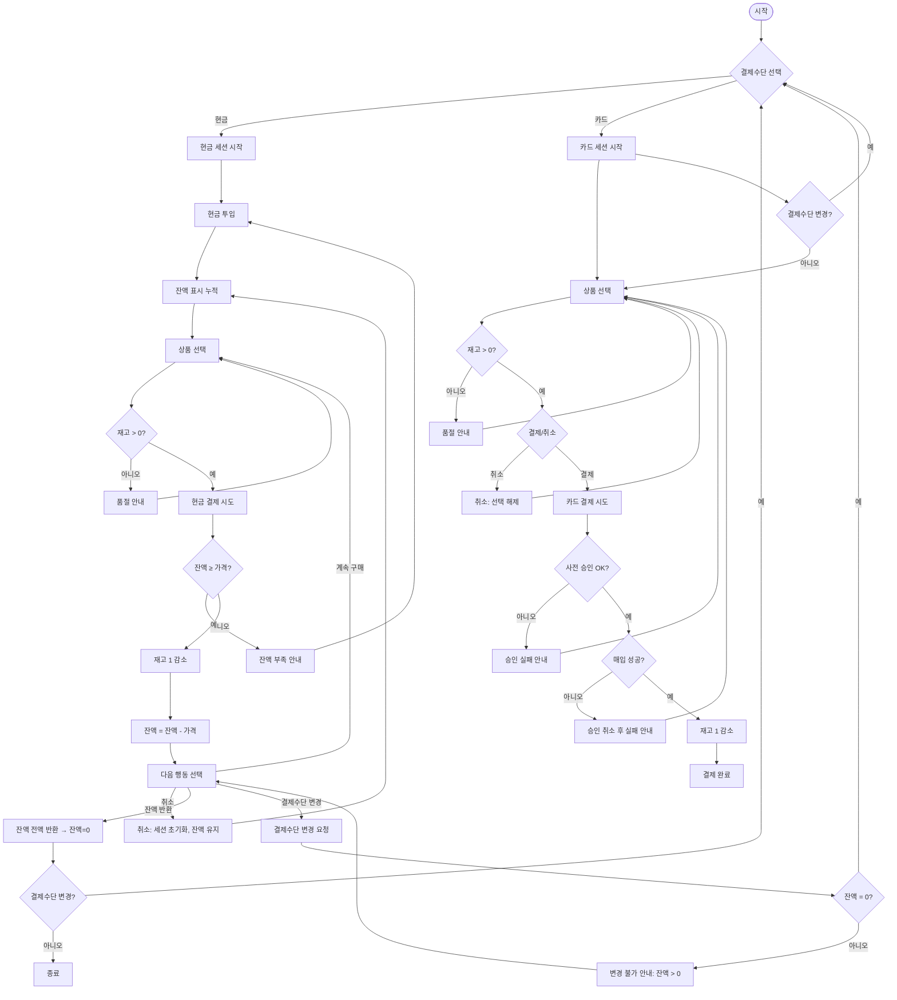

# 민규 자판기 (Minyku Vending Machine)

React와 TypeScript로 구현된 자판기 시뮬레이터입니다. 현금과 카드 결제를 지원합니다.

## 📊 비즈니스 플로우



**📈 마인드맵 보러가기:** https://www.mermaidchart.com/play?utm_source=mermaid_live_editor&utm_medium=share#pako:eNqNVdtOGlEU_ZUTExNNaqrzaKKNtyZNHzS16UORB8KMpREZMwxpGjDxMpBRMF4KFiwQbDVqowkKWn3oz_g4Z88_9NwGZmCk8kTOXmfvddbee02yL6zKSt9o32JU_RKOhDQdvZ9eiCHU34_G6A9ZjVs7c4sgW4bqPj-j8XmdYAcC_Dg4iIaGxtG8Ep0LfU1aN3WolcEs4uw5AqNmb1ZWF2KepHbRsO5NZOdz-LgMR3VXXpaDpktxUApNheIRVi4groFxD-mioBSkt1oQxuNNLK600bZ5CdU0g_EAw0yGoqFYWAlANQ-FY2Tvl0k6hE0DausMKwDOw5SwPqepcgA21-0DUzwrKBiLIMNORZTw0ryuhpeSUL20GjU0joZfrTKWrRBBIigYOGtC8YRdm9E0VZtXo_JsgjA_MKFGihRMvNEMdlDwyVQ0GYYIR4VwHs77QGXCuwajKgBtnq8TMTmeFBo8bp0iq75m3Vy46DLEE3RZzFEQ363B8bWHM5fbJ5XgO6XG4oll2gOm0wipvgeZHO8ojzHctCInwrpTaAyJP0OCLcNzDINPLOqKxoTA2ROo5JB9uIV3S-2eiVHkMo0iD4rGWgnYGFoNAzI7yLq9xGcnqY5GeKHw55zwpxNLJifKKPCj0dbMNk3rvm6X8i-cV0C5BmdrQfdQ-iQWGteLdqmYQu-URaKlIwjUjHYQPWYOROqxYaYMB4ueh2KflIn40oh3SXGD6PjX6bqD4ZWLZkospV_UGYoUmqGEfqbxr1y3wpwPVJoIb5yTO1A18XYe79SRDw0xsLS5-FvZpx_dV1IOL11Xllf0gG_WozzcXAVdj-BgR_iPiqYmWyMmNlacu4e2rYU76FmOyShZTF4kIKrjO5O8R2yHIwh1hqB3ZDt8Eh6aRIP_-CQH0anTZO6T4pqfTwpIh6dIPX1N6jA2qYezSb2tTertbZJfsra7zWp8s8T0vuTLtSqszYn6rqImu1aRvhHZhSbJ4cugMxkvl-L-STNxfZ8wWI0v25ymTCT0SBI2LsmGIth-gMo9mn3LFRPRJ9SioYC4AdkTO3feSzB3LsdaQyt6QlOSxLLIx488-Zp8x0WveKi78gf1s9wqyrRC9g_jGfXdGb3WLnV5Ozd0NaYwIR0FS4bHN7i-o37uAJU1Z3usehmn96irwPcMHDZJR6_IGDPj2D4doLofXUB1D-HfaboDtXVhAoPdq9DyNekZzij1dEap0xk9avWt_gMvAVK6

## 🚀 기술 스택

### Frontend

- **React** 19.1.1 - UI 라이브러리
- **TypeScript** 5.8.3 - 정적 타입 검사
- **Vite** 7.1.2 - 빌드 도구
- **Tailwind CSS** 4.1.12 - 스타일링

### 개발 도구

- **ESLint** 9.33.0 - 코드 품질 관리
- **PNPM** 9.15.0 - 패키지 매니저

## ⚡ 시작하기

### 필수 조건

- **Node.js** 18.0.0 이상
- **PNPM** 9.15.0 이상

### 설치 및 실행

1. **의존성 설치**

   ```bash
   pnpm install
   ```

2. **개발 서버 실행**

   ```bash
   pnpm dev
   ```

   브라우저에서 `http://localhost:5173`으로 접속

3. **프로덕션 빌드**

   ```bash
   pnpm build
   ```

4. **빌드 미리보기**

   ```bash
   pnpm preview
   ```

5. **코드 검사**
   ```bash
   pnpm lint
   ```

## 📁 프로젝트 구조

```
minyku-vending-machine/
├── public/                    # 정적 자산
├── src/
│   ├── components/           # React 컴포넌트
│   │   ├── CardPanel.tsx         # 카드 결제 패널
│   │   ├── CashPanel.tsx         # 현금 결제 패널
│   │   ├── EventLog.tsx          # 이벤트 로그 표시
│   │   ├── ItemGrid.tsx          # 상품 그리드
│   │   ├── PayButton.tsx         # 결제 버튼
│   │   ├── PaymentControls.tsx   # 결제 제어
│   │   └── PaymentMethodButtons.tsx # 결제수단 선택
│   │
│   ├── hooks/               # 커스텀 React 훅
│   │   ├── index.ts             # 훅 모듈 내보내기
│   │   ├── useVendingMachine.ts # 자판기 상태 관리 훅
│   │   ├── useToast.ts          # 토스트 메시지 관리 훅
│   │   ├── useEventLog.ts       # 이벤트 로그 관리 훅
│   │   └── useVendingMachineActions.ts # 자판기 액션 관리 훅
│   │
│   ├── data/                # 정적 데이터
│   │   └── products.ts          # 상품 데이터
│   │
│   ├── domains/             # 도메인 로직
│   │   ├── gateway/             # 외부 시스템 연동
│   │   │   ├── CardGateway.ts       # 카드 게이트웨이 인터페이스
│   │   │   └── MockGateway.ts       # 목 게이트웨이 구현체
│   │   │
│   │   ├── payment/             # 결제 도메인
│   │   │   ├── CardPayment.ts       # 카드 결제 로직
│   │   │   ├── CashPayment.ts       # 현금 결제 로직
│   │   │   └── PaymentMethod.ts     # 결제수단 추상화
│   │   │
│   │   ├── product/             # 상품 도메인
│   │   │   ├── InMemoryInventory.ts # 인메모리 재고 관리
│   │   │   ├── InventoryPort.ts     # 재고 포트 인터페이스
│   │   │   └── Product.ts           # 상품 모델
│   │   │
│   │   └── VendingMachineCore.ts # 자판기 핵심 로직
│   │
│   ├── utils/               # 유틸리티 함수
│   │   └── async.ts            # 비동기 처리 헬퍼
│   │
│   ├── App.tsx              # 메인 앱 컴포넌트
│   ├── index.css            # 글로벌 스타일
│   ├── main.tsx             # 앱 엔트리 포인트
│   └── vite-env.d.ts        # Vite 타입 정의
│
├── index.html               # HTML 엔트리 포인트
├── package.json             # 패키지 설정
├── pnpm-lock.yaml          # 의존성 락 파일
├── vite.config.ts          # Vite 설정
├── tsconfig.json           # TypeScript 설정
├── tsconfig.app.json       # 앱용 TypeScript 설정
├── tsconfig.node.json      # Node.js용 TypeScript 설정
├── eslint.config.js        # ESLint 설정
└── README.md               # 프로젝트 문서
```

## 🏗️ 아키텍처

### 도메인 계층 (domains/)

- **VendingMachineCore**: 자판기의 핵심 비즈니스 로직
- **Payment**: 결제 관련 도메인 (현금/카드)
- **Product**: 상품 및 재고 관리 도메인
- **Gateway**: 외부 시스템 연동 (카드 결제 등)

### 프레젠테이션 계층 (components/, hooks/)

- **컴포넌트**: React 컴포넌트들이 도메인 로직을 사용하여 UI 구성
- **훅**: 컴포넌트 로직을 재사용 가능한 커스텀 훅으로 분리
- 각 컴포넌트와 훅은 단일 책임 원칙을 따름

### 데이터 계층 (data/)

- 정적 데이터 및 초기 설정값 관리

## 🎯 주요 기능

### 💰 현금 결제

- 동전/지폐 투입 시뮬레이션
- 잔액 관리 및 거스름돈 반환
- 연속 구매 지원

### 💳 카드 결제

- 사전 승인 → 매입 프로세스
- 결제 실패 시 자동 롤백
- 실시간 결제 상태 표시

### 📦 재고 관리

- 실시간 재고 확인
- 품절 상품 구매 방지
- 구매 시 자동 재고 차감

### 🎣 커스텀 훅

- **useVendingMachine**: 자판기 핵심 상태 관리 (상품, 선택, 결제수단 등)
- **useToast**: 토스트 메시지 표시 및 관리
- **useEventLog**: 이벤트 로그 히스토리 관리
- **useVendingMachineActions**: 자판기 액션 핸들러 관리 (선택, 결제, 취소 등)

## 🧪 개발 가이드

### 새로운 결제수단 추가

1. `domains/payment/`에 새로운 PaymentMethod 구현체 생성
2. 필요시 `domains/gateway/`에 외부 연동 로직 추가
3. UI 컴포넌트에서 새로운 결제수단 버튼 추가

### 상품 데이터 수정

`src/data/products.ts` 파일을 수정하여 상품 정보 변경 가능

### 커스텀 훅 활용

- 새로운 기능 추가 시 관련 로직을 커스텀 훅으로 분리하여 재사용성 증대
- 상태 관리와 액션 핸들러를 분리하여 컴포넌트의 복잡도 감소
- `hooks/` 디렉토리에 새로운 훅 추가 후 `index.ts`에서 export

### 스타일 커스터마이징

Tailwind CSS를 사용하여 컴포넌트별 스타일 조정 가능
